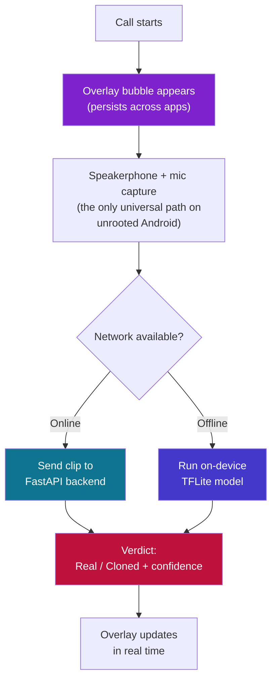
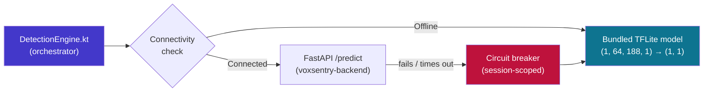

<div align="center">

# 📱 VoxSentry App

### Real-Time Voice Clone Detection, Running on Your Phone — During the Call

**A React Native Android app that listens during live calls and warns you the moment a voice sounds synthetic.**

Part of **VoxSentry** — built for **Smart India Hackathon 2026** · Problem Statement **SIH26104**

[](https://expo.dev/)
[](https://reactnative.dev/)
[](https://www.typescriptlang.org/)
[](https://kotlinlang.org/)
[](https://www.tensorflow.org/lite)

[](https://github.com/kushbansal2005/Voxsentry-app/stargazers)
[](https://github.com/kushbansal2005/Voxsentry-app/network/members)
[](https://github.com/kushbansal2005/Voxsentry-app/commits/master)
[](./LICENSE)

<br/>

<a href="#-how-it-works"><strong>How It Works »</strong></a>
·
<a href="#-getting-started">Getting Started</a>
·
<a href="#-architecture">Architecture</a>
·
<a href="#-known-issues--gotchas">Known Issues</a>

</div>

<br/>

> [!NOTE]
> This repo is one of four VoxSentry repositories. It's the on-device layer — it talks to [`voxsentry-backend`](https://github.com/vineetm1204-m/voxsentry-backend) when online, and falls back to a bundled `.tflite` model (trained in [`voxsentry-mL`](https://github.com/vineetm1204-m/voxsentry-mL)) when offline. See [Related Repositories](#-related-repositories).

---

## 📑 Table of Contents

<details open>
<summary>Click to expand</summary>

- [Overview](#-overview)
- [How It Works](#-how-it-works)
- [Screens & Features](#-screens--features)
- [Architecture](#-architecture)
- [Tech Stack](#-tech-stack)
- [Getting Started](#-getting-started)
  - [Prerequisites](#prerequisites)
  - [Install](#install)
  - [Run on a Device](#run-on-a-device)
- [Project Structure](#-project-structure)
- [The Overlay Permission](#-the-overlay-permission)
- [Known Issues & Gotchas](#-known-issues--gotchas)
- [Roadmap](#-roadmap)
- [Related Repositories](#-related-repositories)
- [Team](#-team)
- [License](#-license)

</details>

---

## 🔍 Overview

**`voxsentry-app`** is the Android client of VoxSentry — it runs quietly in the background during a phone call and tells you, in real time, whether the voice on the other end is likely **real or AI-cloned**. Detection happens through a floating overlay bubble that persists across apps, so protection doesn't stop when you switch screens mid-call.

| Component | Repo | Role |
|---|---|---|
| 📱 **Android app** *(this repo)* | `voxsentry-app` | Real-time call protection via a floating overlay bubble |
| ⚙️ **Backend** | [`voxsentry-backend`](https://github.com/vineetm1204-m/voxsentry-backend) | FastAPI service for online inference |
| 🧬 **ML training** | [`voxsentry-mL`](https://github.com/vineetm1204-m/voxsentry-mL) | Notebooks producing the `.tflite` model this app bundles |
| 🌐 **Web app** | [`voxsentry-web`](https://github.com/vineetm1204-m/voxsentry-web) | Marketing site + live in-browser demo |

---

## 🧠 How It Works



> **Why speakerphone + mic, not call-stream capture?** Android explicitly blocks `MediaProjection`/`AudioPlaybackCapture` for `USAGE_VOICE_COMMUNICATION` streams — there's no API that lets an app tap the raw call audio on an unrooted phone. Capturing off speakerphone through the microphone is the only detection path that genuinely works across devices, so that constraint shaped the whole app architecture rather than being a workaround.

---

## 🎛️ Screens & Features

<details open>
<summary><strong>☎️ Floating Overlay Bubble</strong> — the core feature</summary>
<br/>

A native Android overlay window that stays on top of any app during a call, showing a live verdict without requiring the user to switch back into VoxSentry. Built as a Kotlin native module since this requires OS-level window permissions React Native can't grant on its own.

</details>

<details>
<summary><strong>🔐 Login</strong></summary>
<br/>

Standard auth entry point into the app.

</details>

<details>
<summary><strong>📊 Dashboard</strong></summary>
<br/>

At-a-glance view of protection status and recent activity.

</details>

<details>
<summary><strong>🕒 Detection History</strong></summary>
<br/>

Log of past calls with their verdicts, so a user can review what was flagged after the fact.

</details>

<details>
<summary><strong>🎙️ Voice Library</strong></summary>
<br/>

Enrolled/trusted voices, feeding into the broader VoxSentry voice-recognition roadmap.

</details>

<details>
<summary><strong>⚙️ Settings</strong></summary>
<br/>

App configuration — permissions, detection sensitivity, and related preferences.

</details>

> Exact screen behavior lives in `src/` — the above reflects the app's intended feature set; check the source for current implementation status of each.

---

## 🏗️ Architecture

### Hybrid inference: online-first, offline-capable



- **Online path:** audio is sent to the FastAPI backend, which runs the full CNN+BiLSTM model.
- **Offline path:** a Kotlin-side mel-spectrogram extractor prepares a `[1, 64, 188, 1]` float32 feature grid, matching the preprocessing contract locked in [`voxsentry-mL`](https://github.com/vineetm1204-m/voxsentry-mL) exactly — any drift here silently produces wrong verdicts, so this is the most safety-critical piece of code in the app.
- A session-scoped **circuit breaker** in `DetectionEngine.kt` prevents the app from repeatedly retrying a dead backend mid-call and instead falls back to on-device inference.

---

## 🧰 Tech Stack

<table>
<tr>
<td valign="top" width="33%">

**App shell**
- React Native (Expo SDK 54)
- TypeScript
- Expo Router / navigation

</td>
<td valign="top" width="33%">

**Native (Android)**
- Kotlin native modules
- Android overlay window
- `TelephonyManager` / `NotificationListenerService`

</td>
<td valign="top" width="33%">

**On-device ML**
- TensorFlow Lite
- Dynamic-range quantized model
- Kotlin mel-spectrogram extraction

</td>
</tr>
</table>

---

## ⚡ Getting Started

### Prerequisites

- Node.js (LTS) and npm
- Android Studio, with `ANDROID_HOME` and `PATH` configured
- A physical Android device or emulator — **native features require a custom dev client**, Expo Go cannot run this app

### Install

```bash
git clone https://github.com/kushbansal2005/Voxsentry-app.git
cd Voxsentry-app
npx expo install
```

> [!IMPORTANT]
> Use `npx expo install`, not plain `npm install`, when adding or fixing dependencies — it resolves versions compatible with this Expo SDK and avoids Metro bundler mismatches (e.g. `@react-native-async-storage/async-storage` needs to be installed this way, not just imported).

### Run on a Device

Local USB builds are the fastest iteration loop once your Android environment is set up:

```bash
npx expo run:android
```

This is preferred over EAS cloud builds for day-to-day development — EAS is better reserved for release builds.

> [!TIP]
> If an EAS build fails on a Gradle mismatch, check `android/gradle/wrapper/gradle-wrapper.properties` — Expo SDK 54 / React Native 0.81.5 needs **Gradle 8.13+**; older pins (like 8.10.2) will fail the build.

---

## 📁 Project Structure

```
Voxsentry-app/
├── android/         # Native Android project (Kotlin modules, overlay, Gradle config)
├── assets/          # Images, icons, fonts
├── dist/            # Build output
├── src/             # App screens & shared React Native code
├── App.js           # App entry point
├── app.json          # Expo app configuration
├── babel.config.js
├── eas.json          # EAS build configuration
├── AGENTS.md          # AI-assisted development conventions
├── CLAUDE.md           # Claude/agent-specific project instructions
└── LICENSE              # MIT
```

---

## 🔑 The Overlay Permission

The floating bubble that makes real-time, cross-app detection possible requires Android's **"draw over other apps"** overlay permission. This is a sensitive permission from Android's perspective, so the setup flow should be explicit about why it's needed rather than requesting it silently — this matters both for user trust and for the honest-framing principle the rest of VoxSentry follows (see the web app's "what this does NOT do" section).

---

## 🐛 Known Issues & Gotchas

- **Expo Go cannot run this app.** The overlay window, call-state listener, and TFLite inference are all native features requiring a custom dev client built via EAS or `expo run:android`.
- **`MediaProjection`/`AudioPlaybackCapture` is blocked for call audio.** Android does not allow apps to tap `USAGE_VOICE_COMMUNICATION` streams directly — speakerphone + microphone capture is the only path that works on unrooted devices.
- **Preprocessing must match training exactly.** The on-device mel-spectrogram extraction in Kotlin must reproduce the `voxsentry-mL` preprocessing contract bit-for-bit (16kHz, mel bins, hop length, normalization) — any mismatch produces confidently wrong verdicts with no error signal.
- **Gradle version drift breaks EAS builds.** Confirm `gradle-wrapper.properties` targets Gradle 8.13+ for this Expo/RN version pairing.
- **Missing-dependency Metro errors** usually mean a package was imported but never installed via `npx expo install` — audit and reinstall rather than patching around the error.

---

## 🗺️ Roadmap

- [x] Floating overlay bubble with cross-app persistence
- [x] Kotlin native call-state detection modules
- [x] TFLite offline inference path
- [x] Hybrid online/offline `DetectionEngine` with circuit breaker
- [ ] Validate Kotlin mel-spectrogram extraction numerically against the Python/librosa reference (highest-risk item before trusting on-device output)
- [ ] Confirm overlay persistence + live history updates hold up across extended real-device testing
- [ ] Voice-enrollment / speaker-embedding matching for the Voice Library screen
- [ ] iOS app *(not currently planned for this hackathon round)*

---

## 🔗 Related Repositories

- 📱 **`voxsentry-app`** *(this repo)* — React Native (Expo) Android app with real-time call overlay
- ⚙️ [`voxsentry-backend`](https://github.com/vineetm1204-m/voxsentry-backend) — FastAPI inference service (CNN+BiLSTM)
- 🧬 [`voxsentry-mL`](https://github.com/vineetm1204-m/voxsentry-mL) — training notebooks producing the `.tflite` model this app bundles
- 🌐 [`voxsentry-web`](https://github.com/vineetm1204-m/voxsentry-web) — Next.js marketing site + live demo

---

## 🧑‍💻 Team

Built by a 6-person team for **Smart India Hackathon 2026**.

---

## 📄 License

Licensed under the **MIT License** — see [`LICENSE`](./LICENSE) for details.

<div align="center">

<br/>

**[⬆ back to top](#-voxsentry-app)**

</div>
